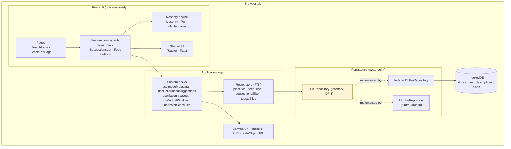
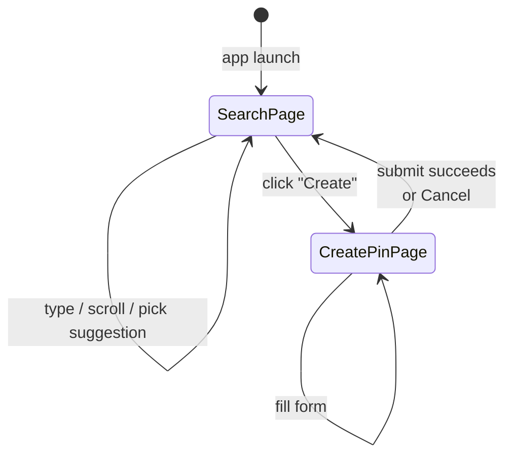
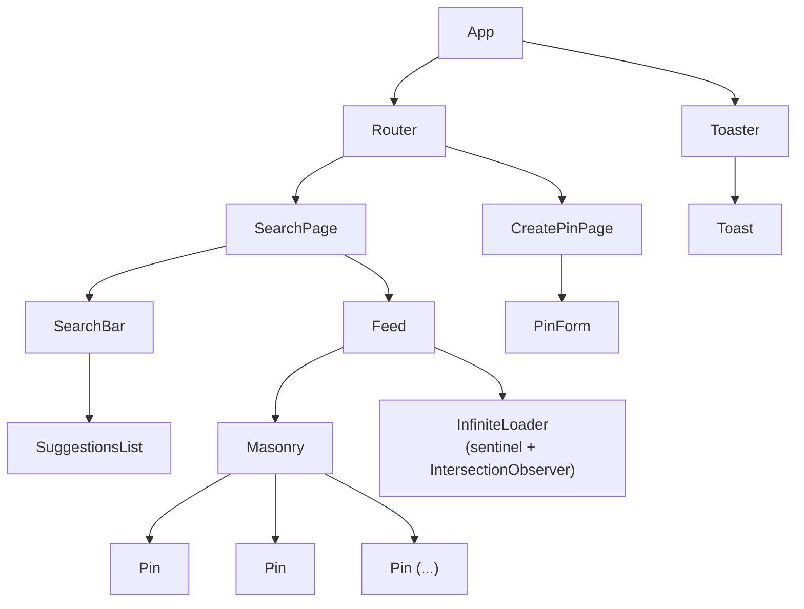
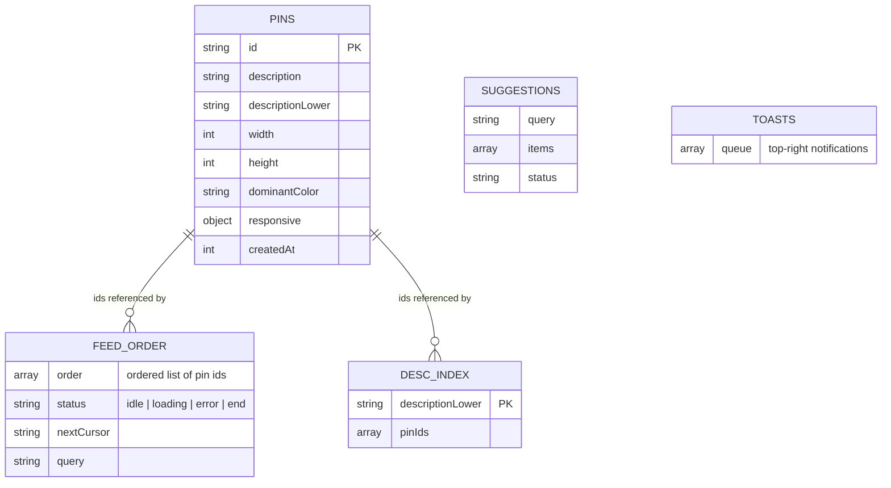
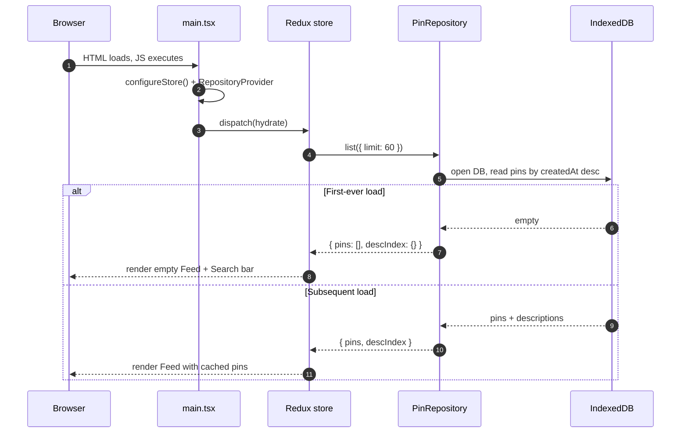
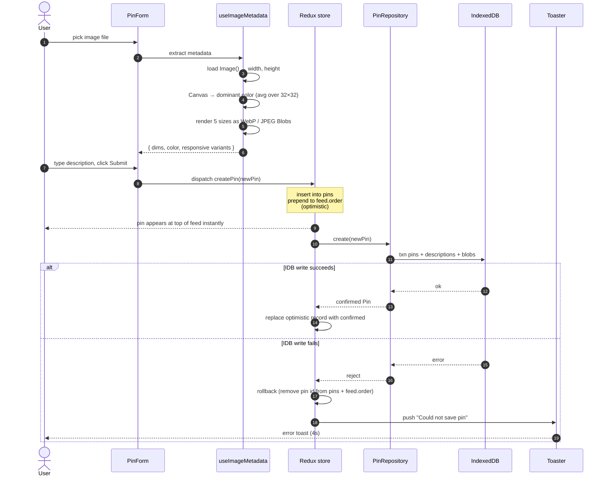
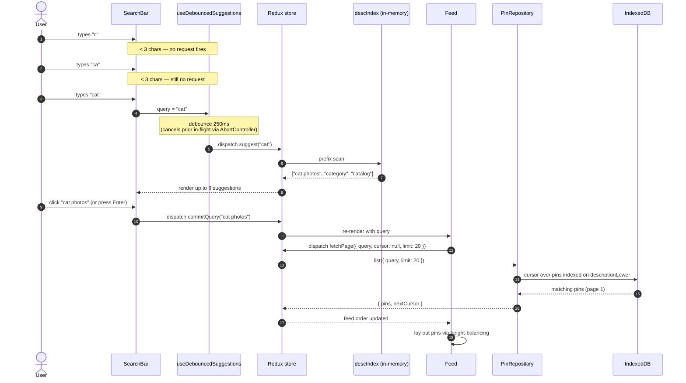
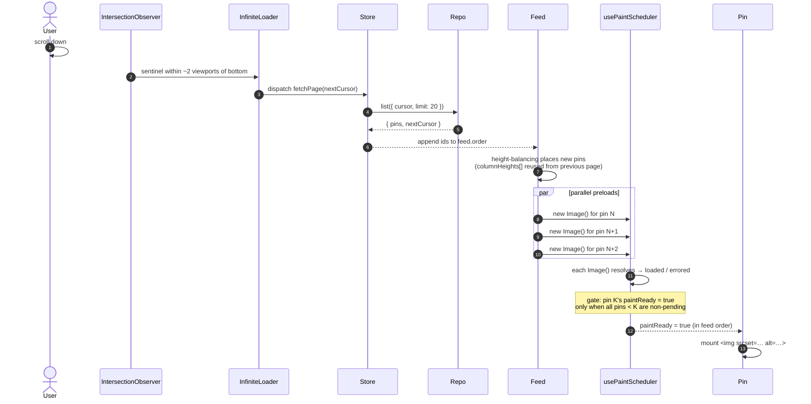
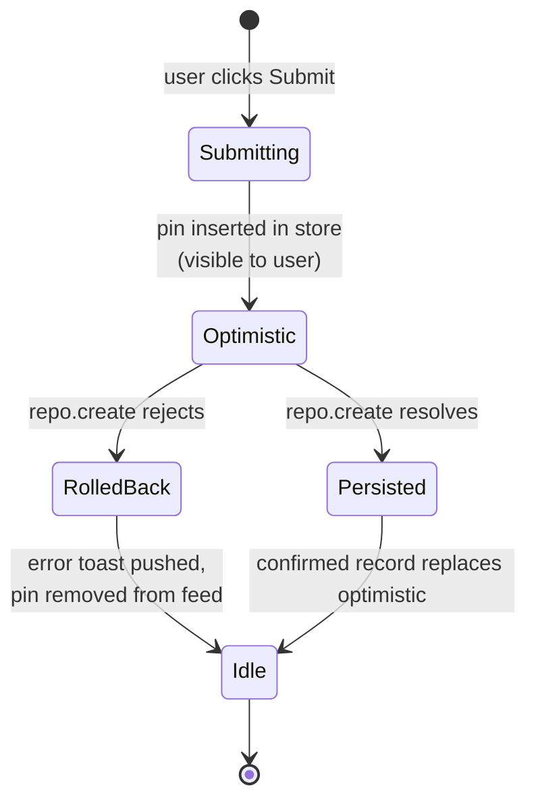

# SPEC — Pin Search & Create

A Pinterest-style web app where a user creates pins (image + description) and searches them in a responsive masonry feed. IndexedDB is the persistence layer today, hidden behind a `PinRepository` interface so a real backend can swap in later without touching UI or Redux.

---

## How to read this document

Every major architectural or UX-critical decision is recorded as a **Decision Record** with four parts:

1. **Problem** — the specific challenge being addressed.
2. **Options** — the alternatives considered.
3. **Pros & Cons** — trade-offs of each option.
4. **Decision** — what we picked and exactly why it won.

Decision records are reserved for choices that impact **scalability, maintainability, or core user experience**. Standard conventions (file layout, naming, lint config) appear in §10 without this treatment.

**Evidence base.** This project has no prior benchmarks or production telemetry. Each decision cites: (a) the original Pinterest front-end brief shipped with this project (referred to below as **[BRIEF]**, the system-design write-up that motivated the project), (b) the **MDN** documentation pages for the relevant web platform feature, and (c) the **[REACT19]** React 19 docs where API choices apply. Where a decision is heuristic and not yet measured, it is flagged with **[UNVERIFIED]** and §11 records the trigger to revisit.

---

## 1. Objective

**Build:** A single-user, browser-only React app with two pages — **Create Pin** and **Search Pins** — that demonstrates a production-grade Pinterest feed: responsive masonry layout, debounced search-with-suggestions, mock-paginated infinite scroll, DOM virtualization, and in-order paint scheduling.

**Why:** Exercise the front-end patterns Pinterest uses (absolute-positioned masonry, height balancing, virtualization, paint gating) on top of a clean architecture (storage interface, normalized Redux store, SOLID components) that scales to millions of users and hundreds of results per query.

**Primary target:** Desktop browsers (Chrome-first; serve WebP when supported). Fully responsive down to mobile.

**Non-goals (this iteration):** real backend, auth, PWA, stale-tab auto-refresh, SSR, hover previews / boards / pin-detail. Each was either explicitly deferred by the user or called "outside scope" by [BRIEF].

---

## 2. Decision Records — Architecture

### DR-1 · Persistence is hidden behind a `PinRepository` interface

- **Problem.** [BRIEF] requires IndexedDB now but says "IndexedDB would be replaced with BE API so construct this as an interface which can be changed later." How do we structure the code so the swap is a one-file change instead of a refactor?
- **Options.**
  1. Call `idb` directly from Redux thunks.
  2. Per-concern services (PinService, SuggestionService, ImageService) injected into thunks.
  3. A single `PinRepository` interface with one concrete `IndexedDbPinRepository` today and a future `HttpPinRepository`.
- **Pros & Cons.**
  - *Option 1:* Fastest to write. **But** every thunk knows IDB primitives (`transaction`, `objectStore`, cursors); swapping to HTTP rewrites all thunks. Couples Redux to a storage technology.
  - *Option 2:* Granular and testable. **But** four methods don't need four classes; surface-area explosion with no real coupling benefit.
  - *Option 3:* One interface (`list`, `suggest`, `create`, `getById`), one implementation today. Tests inject a fake. Future HTTP impl drops in unchanged for callers.
- **Decision.** **Option 3.** [BRIEF] mandates "construct this as an interface which can be changed later" almost literally. Cursor-based pagination is part of the contract so the HTTP impl can keyset-paginate without API redesign.

### DR-2 · State management uses Redux Toolkit (RTK)

- **Problem.** [BRIEF] requires "Redux/Flux Architecture" with optimistic updates and a suggestion index optimized for keystroke-rate reads. Pick the concrete state library.
- **Options.**
  1. Plain Redux (hand-written actions, reducers, middleware).
  2. **Redux Toolkit** (`createSlice`, `createAsyncThunk`, `createEntityAdapter`).
  3. Zustand or a Flux-like custom store.
- **Pros & Cons.**
  - *Plain Redux:* explicit, no opinions. **But** ~3× boilerplate, manual immutability discipline, no built-in entity normalization.
  - *RTK:* idiomatic Redux today ([Redux style guide]); Immer-backed reducers; `createAsyncThunk` provides the pending/fulfilled/rejected lifecycle our optimistic-create flow needs; `createEntityAdapter` provides the normalized pin storage we need for de-duplication between feed and search results.
  - *Zustand:* lightweight, simple API. **But** diverges from [BRIEF]'s explicit "Redux/Flux" wording; lacks entity-adapter primitives.
- **Decision.** **RTK.** [BRIEF] specifies Redux; RTK is the lowest-friction way to comply without inventing infrastructure. The normalization + thunk lifecycle directly maps to our two hardest cases (optimistic create with rollback, debounced suggestion fetch with cancellation).

### DR-3 · TypeScript (migrate from JS scaffold)

- **Problem.** The scaffold is plain JS. The spec has a sizable `Pin` type, a swappable repository interface, and a Redux store with strict shape invariants. Drift between the IDB repo and a future HTTP repo would silently break the app. Should we adopt TS now or rely on JSDoc?
- **Options.** (1) Stay in JS. (2) Adopt TypeScript with `strict: true`.
- **Pros & Cons.**
  - *JS:* zero setup. **But** repository-interface contracts and Redux state shapes are exactly the kind of cross-module invariants TS catches at compile time; JSDoc is easy to skip and noisy.
  - *TS strict:* one config step (`tsconfig.json`, `npm i -D typescript`); compile-time safety on the swap-point and Redux selectors.
- **Decision.** **TypeScript strict.** The cost is a single setup step; the benefit is enforcement of the most important architectural invariant (the repository contract from DR-1).

### DR-4 · IDB schema is split into three object stores

- **Problem.** [BRIEF] wants pins, image bytes, and a description index that supports suggestions. A single denormalized store would be simpler, but suggestion reads must not pull image bytes off disk per keystroke.
- **Options.**
  1. One `pins` store containing description + metadata + image Blobs inline.
  2. **Three stores: `pins` (metadata + indexes), `descriptions` (inverted index), `blobs` (image bytes keyed by `${pinId}:${size}`).**
- **Pros & Cons.**
  - *One store:* one transaction per write. **But** every read pulls Blob bytes even when only metadata is needed (suggestions, feed paging); IDB returns full records, not projected columns.
  - *Three stores:* slightly more complex writes (one transaction over multiple stores). **But** metadata reads stay small; the inverted index gives O(log N) prefix scans via `IDBKeyRange.bound(prefix, prefix + '￿')` ([MDN: IDBKeyRange]).
- **Decision.** **Three stores.** The cost is a multi-store transaction on create; the benefit is suggestion reads that never touch image bytes — critical at keystroke rate.

### DR-5 · Cursor-based pagination, not offset

- **Problem.** Mock pagination today; real backend tomorrow. Pick a pagination shape that doesn't need rework.
- **Options.** (1) Offset (`page` + `limit`). (2) Cursor (opaque token).
- **Pros & Cons.**
  - *Offset:* trivial to implement against IDB (skip + take). **But** at backend scale, offset queries on a sorted index degrade linearly with offset; offsets break under concurrent inserts (results shift).
  - *Cursor:* slightly more code (issue an opaque token = last seen `createdAt|id`). **But** O(log N) keyset reads against any sorted index; stable under inserts (new pins prepend, never invalidate cursors).
- **Decision.** **Cursor.** The interface defined now is the contract a future HTTP backend must serve; offset would be a public-API regression to fix later. Reference: [Use the index, Luke! — pagination chapter] on offset vs keyset.

---

## 3. Decision Records — Masonry & Rendering

### DR-6 · Absolute positioning, not rows-of-columns

- **Problem.** [BRIEF] discusses two masonry approaches. We must pick one, knowing it constrains accessibility (tab order), virtualization, and resize behavior.
- **Options.**
  1. **Rows-of-columns** — equal-width flex columns, items appended into each column container.
  2. **Absolute positioning** — single container, each item placed via computed `top`/`left` or `transform`.
- **Pros & Cons.**

  | Concern | Rows-of-columns | Absolute positioning |
  |---|---|---|
  | CSS complexity | Trivial (`display: flex`) | Container needs `position: relative` + computed `height`; items need computed coords |
  | DOM order | **Column-first** — items in column 1, then column 2, … | **Feed order** — natural reading order |
  | Keyboard tab order | Broken (tabs down column 1 then jumps to column 2 top) | Matches visual reading order |
  | Screen-reader sequence | Same problem as tab order | Correct |
  | Auto-reflow on item-height change | Yes (browser does it) | Manual recompute needed for items below |
  | Virtualization | Hard — removing a node shifts later items in that column, scroll position jumps | Trivial — removing a node leaves siblings put |
  | Resize across breakpoints | Browser handles | Manual recompute required |

- **Decision.** **Absolute positioning.** Two reasons:
  1. **Accessibility** — column-first DOM order is a real-user-harming bug for keyboard and screen-reader users; we cannot ship that.
  2. **Virtualization** — DR-10 requires it, and it composes cleanly only with absolute placement.

  The downsides (more code; manual recompute) are bounded — we recompute only when **column count** changes (DR-9), so the work is rare. We also know image intrinsic dimensions at upload time so the "measure offscreen first" problem Pinterest's open-source `Masonry` solves does not apply: we compute `renderedHeight = columnWidth × (height/width)` directly.

### DR-7 · CSS `transform: translate(...)` for positioning, not `top`/`left`

- **Problem.** Within absolute positioning (DR-6), which CSS property carries the per-item placement?
- **Options.** (1) `top`/`left`. (2) `transform: translate(x, y)`.
- **Pros & Cons.**
  - *top/left:* conceptually simple; no stacking-context surprises. **But** changes trigger **layout** (reflow) on the compositor pipeline; not GPU-accelerated.
  - *transform:* GPU-accelerated; updates run on the compositor without re-layout (per [MDN: CSS will-change] and the [web.dev guide on rendering performance]). **But** creates a new stacking context; sub-pixel rendering can introduce blur if not snapped.
- **Decision.** **`transform`.** Aligns with [BRIEF] ("Pinterest uses CSS transforms … presumably because it is more performant"). The stacking-context caveat is irrelevant here because pins do not need to escape their container, and we snap to integer pixels.

### DR-8 · Ordering: height balancing, not round-robin

- **Problem.** Given absolute positioning, in which order do pins enter columns? The choice affects both visual quality and CPU cost per page.
- **Options.**
  1. Round-robin (pin i → column i mod C).
  2. **Height balancing** (each pin → currently shortest column, ties broken leftmost).
- **Pros & Cons.**
  - *Round-robin:* O(N), trivially incremental. **But** ignores aspect ratio — tall items in column 1 produce a visibly unbalanced wall.
  - *Height balancing:* O(N × C) where C = column count ≤ 6 — i.e., effectively O(N). Produces visually balanced columns. Preserves feed order top-to-bottom across columns.
- **Decision.** **Height balancing.** The asymptotic cost is dominated by the small constant column count; the visual win is significant. We cache `columnHeights[]` on the Masonry component so each new page extends the layout in O(pageSize × C) without re-laying-out earlier pins.

### DR-9 · Resize recompute is gated on column-count change

- **Problem.** Resize fires per pixel; we cannot recompute the entire masonry layout per frame.
- **Options.**
  1. Recompute on every resize event.
  2. Debounce all recomputes.
  3. **Recompute only when column count crosses a breakpoint; ignore intra-breakpoint resizes.**
- **Pros & Cons.**
  - *(1)* trivially correct, catastrophic performance at scale.
  - *(2)* better, but still recomputes when the layout hasn't actually changed (window edge dragged a few px).
  - *(3)* Column width is a function of breakpoint, not exact viewport — within a breakpoint, cached positions remain correct. Recompute happens at most ~5 times across all possible viewports.
- **Decision.** **(3) with a 150 ms debounce on the resize handler** to coalesce rapid breakpoint crossings. The debounce is short enough that the layout settles before the user releases the window edge.

### DR-10 · DOM virtualization with device-class cap

- **Problem.** Hundreds of pins in the DOM bloats memory, slows React reconciliation, and adds reflow cost per scroll. [BRIEF] specifies ≤ 40 on desktop, ≤ 10–20 on mobile.
- **Options.**
  1. Render everything (no virtualization).
  2. Viewport-only.
  3. **Viewport + buffer window, capped by device class.**
  4. Viewport + buffer + DOM-node recycling pool.
- **Pros & Cons.**
  - *(1)* DOM grows unbounded; rejected by [BRIEF].
  - *(2)* Causes a flicker as items mount on scroll; no read-ahead.
  - *(3)* Buffer of [−1, +2] viewports gives upward back-buffer and downward read-ahead. Cap (40/20) is a hard ceiling under deep scroll. Absolute positioning (DR-6) makes node removal cheap — siblings don't shift.
  - *(4)* Adds an explicit object pool over React's keyed reconciliation. **But** React 19 already reuses DOM nodes by key when items re-enter the window ([REACT19] reconciler). Explicit pooling is complexity without measured gain.
- **Decision.** **(3).** Window = [−1, +2] viewports; cap = 40 desktop / 20 mobile-tablet per [BRIEF]. **[UNVERIFIED]** the cap is taken from [BRIEF]'s Pinterest observation; revisit if profiling shows we can safely raise it on high-end desktops.

### DR-11 · Paint scheduling: load in parallel, paint in feed order

- **Problem.** On a slow network, naïvely mounting `` for every pin causes "popcorn" — images appear in random network-completion order, which feels broken in a multi-column feed where the user's eye expects top-to-bottom reading order.
- **Options.** [BRIEF] enumerates four.
  1. Mount all `` immediately; paint as bytes arrive.
  2. Sequential: load image N, then start image N+1.
  3. Parallel load, paint all at once.
  4. **Parallel load, paint in feed order (gate paint of pin N on resolution of 1..N-1).**
- **Pros & Cons.**

  | | Throughput | Visual order | First paint latency |
  |---|---|---|---|
  | (1) | Best | Random | Fast for fast images, popcorn for slow |
  | (2) | Worst (no concurrency) | Perfect | Very slow |
  | (3) | Best | Simultaneous | Bottlenecked by the slowest image |
  | (4) | Best | Perfect | Bottlenecked only by the *prior* slow images, not by all of them |

- **Decision.** **(4).** Implemented via a `usePaintScheduler` hook tracking per-pin state (`pending|loaded|errored`) for an off-DOM `new Image()` preload. A pin becomes `paintReady` iff every prior pin is non-`pending`. **Errors do not block downstream** (single retry, then treat as resolved) — otherwise one broken image stalls the entire feed below it. React 19 [`<SuspenseList>`][REACT19] would express this declaratively, but it remains experimental; an explicit hook is more predictable and testable.

### DR-12 · Responsive images via ``, not `<picture>`

- **Problem.** Browsers need to pick the right pixel size per device. Two web platform features exist.
- **Options.** (1) `` + `sizes`. (2) `<picture>` with multiple `<source>`.
- **Pros & Cons.**
  - *srcset:* designed for "same image, multiple resolutions" — exactly our case. Browser selects based on DPR and `sizes`. Per [MDN: Responsive images], `srcset` is the right tool when there's no art-direction concern.
  - *picture:* designed for art direction (different crops per breakpoint) or different *formats* via `type="image/webp"` per source. **But** we don't do art direction, and format selection is a one-time feature-detect at app boot (DR-13), simpler than per-pin `<picture>` markup.
- **Decision.** **`` + `sizes`** mapping to the active column width. Markup is shorter, matches the brief's exemplar, and the browser does the right thing.

### DR-13 · WebP when supported, JPEG fallback (feature-detect once at boot)

- **Problem.** [BRIEF] asks for WebP on Chrome. Real Pinterest serves JPEG only (broader legacy reach). We are not bound by legacy IE/old-Safari support.
- **Options.** (1) JPEG only. (2) Always WebP. (3) WebP-with-JPEG-fallback via feature detection.
- **Pros & Cons.**
  - *JPEG only:* maximum compatibility; loses ~25–35% size savings WebP offers ([web.dev: WebP]).
  - *Always WebP:* breaks Safari < 14 and older Android web views.
  - *WebP-with-fallback:* one-time `canvas.toBlob('image/webp')` test at boot; pin generation pipeline emits WebP for capable browsers, JPEG otherwise.
- **Decision.** **WebP-with-fallback.** Brief explicitly asks for it; feature detection is one async call cached for the session. Stored variants record their MIME type so the consumer always knows which to read.

---

## 4. Decision Records — Search & Data Flow

### DR-14 · Suggestion source is an in-memory mirror, not per-keystroke IDB reads

- **Problem.** Suggestions fire at keystroke rate (after 3-char threshold + 250 ms debounce). IDB reads are cheap but not free, and we want sub-millisecond prefix lookups.
- **Options.**
  1. Hit IDB on every debounced keystroke.
  2. **Maintain a mirrored description index in Redux, updated on hydration and on `createPin` fulfillment.**
- **Pros & Cons.**
  - *(1)* always consistent with disk; no extra Redux state. **But** each lookup opens a transaction, runs a cursor over a key range, marshals results — pin counts in the thousands still works fine, but it's wasted work compared to (2).
  - *(2)* in-memory `Record<descriptionLower, pinIds[]>` gives O(prefix-length) prefix scans via `Object.keys(...)` filtered by `startsWith`. Memory cost is bounded by total distinct descriptions × small overhead.
- **Decision.** **(2).** Trades a small RAM bump for a much better keystroke experience. The mirror is initialized on hydration and updated when `createPin` is fulfilled; correctness relies on `createPin` being the only write path (it is).

### DR-15 · Suggestion threshold: ≥ 3 characters, 250 ms debounce

- **Problem.** Below some prefix length, suggestions are useless (too broad); below some debounce window, suggestions are noisy (firing on every keystroke).
- **Options.** Threshold ∈ {1, 2, 3} chars; debounce ∈ {100, 250, 500} ms.
- **Pros & Cons.** [BRIEF] specifies 3 chars; for debounce, 100 ms still fires intra-word, 500 ms feels laggy.
- **Decision.** **3 chars, 250 ms.** Stale responses are dropped via an `AbortController` *and* RTK thunk `condition` (either alone leaves a race where a slow earlier request overwrites a fast later one). **[UNVERIFIED]** the 250 ms value is convention; we can A/B if usage data eventually exists.

### DR-16 · Infinite scroll via IntersectionObserver, not scroll listener

- **Problem.** Detect "near end of feed" to trigger the next page.
- **Options.** (1) `scroll` event listener with throttled `scrollTop`/`scrollHeight` math. (2) `IntersectionObserver` watching a sentinel near the feed bottom.
- **Pros & Cons.**
  - *scroll listener:* universally supported. **But** triggers on every scroll frame; reading `scrollTop`/`scrollHeight` forces synchronous layout ([MDN: forced reflow]); requires throttling.
  - *IntersectionObserver:* async, off main thread; no layout reads; supported in all modern browsers per [MDN: IntersectionObserver].
- **Decision.** **IntersectionObserver** on a sentinel element placed ~2 viewport heights above the feed bottom. Gives the next page time to load + lay out before the user arrives there.

### DR-17 · Optimistic create with explicit rollback action

- **Problem.** [BRIEF] mandates optimistic updates; we must also surface IDB write failures.
- **Options.**
  1. Pessimistic: write to IDB first, then commit to Redux.
  2. Optimistic with rollback in the same slice.
  3. Two slices (pending vs committed) merged in selectors.
- **Pros & Cons.**
  - *(1)* simple. **But** [BRIEF] explicitly rules this out; create feels laggy.
  - *(2)* one slice, one rollback action; pending pins look like regular pins in state.
  - *(3)* clean separation of concerns. **But** every read selector now joins two slices; complexity without behavior gain.
- **Decision.** **(2).** Thunk inserts into `pins` + prepends to `feed.order` synchronously, awaits `repo.create`. On reject: dispatch `feed/createRolledBack(id)` + push an error toast. Successful resolve commits the IDB-returned `Pin` (replacing the optimistic shape, which uses a client-generated UUID that the repo accepts as authoritative).

---

## 5. Decision Records — Testing

### DR-18 · Test pyramid (most-unit, some-integration, fewer-component, no e2e)

- **Problem.** Pick the test mix that maximizes confidence per minute of test runtime, given a single-developer demo project.
- **Options.** (1) Test pyramid. (2) Testing trophy (more integration). (3) Ice-cream cone (mostly e2e/UI).
- **Pros & Cons.** Pyramid wins for code that's largely pure logic (layout math, scheduler, reducers); trophy wins when integration is the riskiest layer; ice-cream cone is rarely advisable.
- **Decision.** **Pyramid.** Layout math, paint scheduling logic, and reducers are highly testable as units; the riskiest integration (Redux + repository + IDB) is covered with `fake-indexeddb`. e2e (Playwright) is deferred — high setup cost, low marginal coverage on a two-route app. Revisit when adding a real backend or visual diffs.

### DR-19 · `fake-indexeddb` for repository/thunk integration tests

- **Problem.** Repository tests need IDB semantics including transactions, but jsdom has no IDB.
- **Options.** (1) Manual mock per test. (2) jsdom + `fake-indexeddb`. (3) Real browser (Playwright + headless Chrome).
- **Pros & Cons.** Manual mocks drift from real IDB behavior; real browser is heavy for what is essentially a unit-level test of the repo.
- **Decision.** **`fake-indexeddb`.** Real-ish semantics (transactions, indexes, key ranges) in Node. Per its docs, it's the standard substitute for IDB in test environments.

---

## 6. Decision Records — Tooling & Project Structure

### DR-20 · Build tool: Vite (keep scaffold)

- **Problem.** Pick a React build/dev tool for a single-page, CSR-only app.
- **Options.**
  1. **Vite** (scaffold default).
  2. Next.js.
  3. Create React App (CRA).
  4. Remix.
  5. Parcel.
- **Pros & Cons.**
  - *Vite:* native ESM dev server with HMR, esbuild + Rollup, minimal config, first-class TS/JSX, fast cold start. No built-in SSR conventions, which is fine here.
  - *Next.js:* opinionated full-stack framework with file-system routing, SSR/SSG/RSC. **But** §1 non-goals explicitly exclude SSR and there is no backend; Next would force conventions (route segments, server components, framework-shaped data fetching) that don't earn their keep.
  - *CRA:* deprecated by the React team in 2023; webpack-based; slow.
  - *Remix:* server-first; same overhead as Next for our CSR-only use case.
  - *Parcel:* zero-config, fast, smaller plugin ecosystem; not the React-19-friendliest default.
- **Decision.** **Vite.** Already the scaffold; no SSR requirement; best-in-class dev experience for client-side React. Cost of switching to anything else is real (rewrite the scaffold), and none of the alternatives offers a benefit this app uses.

### DR-21 · IndexedDB wrapper: `idb`

- **Problem.** The native IndexedDB API is event-based and verbose. Pick the layer between Redux thunks and the browser.
- **Options.**
  1. Raw IndexedDB.
  2. **`idb` (Jake Archibald).**
  3. Dexie.
  4. localForage.
  5. RxDB.
- **Pros & Cons.**
  - *Raw IDB:* zero dependency, full control. **But** event-listener model is awkward to wrap in async/await; transaction lifetime is fragile (auto-commits at end of microtask if you `await` outside it); every consumer reinvents the same promise shim.
  - *`idb` (~7 KB gz):* thin promise wrapper that preserves IDB's mental model (stores, indexes, transactions, cursors). No DSL. Maintained by a Chrome team engineer; the de facto standard.
  - *Dexie (~22 KB gz):* query DSL (`db.pins.where('description').startsWith(...)`); schema migration helper. **But** queries we need (cursor over a key range on `descriptionLower`) are short in raw IDB; the DSL adds no clarity; bigger bundle.
  - *localForage:* key-value abstraction over IDB. **But** loses **indexes** — we need indexes on `createdAt` and `descriptionLower` (DR-4); without them the suggestion index is impossible.
  - *RxDB:* reactive observable DB with replication. Overkill; pulls in RxJS.
- **Decision.** **`idb`.** Lowest impedance to the raw IDB model we already need to think about, smallest bundle hit, no DSL to learn. The decision survives a backend swap because the repository (DR-1) abstracts it away regardless.

### DR-22 · Routing: `react-router-dom` v6

- **Problem.** Two pages (`/`, `/create`). Pick a routing strategy or skip routing.
- **Options.**
  1. No router — single-page tabbed UI with `useState`.
  2. Hash routing (`#/create`).
  3. **`react-router-dom` v6.**
  4. TanStack Router.
  5. Wouter.
- **Pros & Cons.**
  - *No router:* simplest. **But** loses URL state — no shareable links, browser back button is broken, page-level state can't be deep-linked. Bad UX-ergonomics tax for "saving" one dependency.
  - *Hash routing:* works without server URL rewrite config. **But** less clean URLs and worse SEO (though we don't care about SEO here); offers nothing over real routing on a static host that serves `index.html` for any path.
  - *`react-router-dom` v6:* de facto standard, declarative `<Routes>`, large community, supports `loader`s if we ever need them.
  - *TanStack Router:* type-safe routing with file-based or code-based config; growing fast. **But** newer ecosystem; main payoff is type-safe params, which we don't meaningfully use on two routes.
  - *Wouter (~2 KB gz):* hooks-only, tiny. **But** marginal savings on a project that already pays for RTK + idb; smaller ecosystem.
- **Decision.** **`react-router-dom` v6.** Shareable URLs and a working browser back button matter; cost is ~12 KB of well-known, well-supported code. Revisit if TanStack Router stabilizes and our routes accrue typed params.

### DR-23 · Styling: CSS Modules

- **Problem.** ~10 components on a paint-sensitive feed; pick a styling approach.
- **Options.**
  1. Plain global CSS.
  2. **CSS Modules.**
  3. Tailwind CSS.
  4. styled-components / Emotion (runtime CSS-in-JS).
  5. vanilla-extract (zero-runtime CSS-in-JS).
  6. UnoCSS / Linaria.
- **Pros & Cons.**
  - *Global CSS:* zero tooling. **But** class-name collisions inevitable past ~5 components; no scoping.
  - *CSS Modules:* built into Vite, scoped class names per file, zero runtime, integrates with TS via per-`*.module.css` ambient declarations.
  - *Tailwind:* utility-first, fast iteration. **But** adds a build step and a vocabulary; class-name soup in JSX is especially ugly in the perf-critical `<Pin>` and `<Masonry>` paths where every render must be cheap.
  - *styled-components/Emotion:* ergonomic, component-scoped. **But** runtime style injection on render is exactly what we don't want in a paint-sensitive feed; React 19 strict mode + concurrent rendering also surfaces ordering bugs in some setups.
  - *vanilla-extract:* type-safe, zero runtime, TS-native. **But** less common; one more tool to learn for a small app; pays off most when a design-token system exists.
  - *UnoCSS / Linaria:* niche; smaller community.
- **Decision.** **CSS Modules.** Zero runtime cost, zero new tooling on top of Vite, scoped class names. Reconsider if the design system grows beyond ~30 components or we adopt design tokens — vanilla-extract is then the strongest fit.

### DR-24 · Repository structure: feature-first with role folders (Atomic Design rejected)

- **Problem.** Pick a directory layout that supports the SOLID/SRP boundary the brief requires, without inviting churn or constant re-categorization debates as the app grows.
- **Options.**
  1. **Type-based** — `/components`, `/hooks`, `/reducers`, `/utils`, …
  2. **Atomic Design** (Brad Frost) — `/atoms`, `/molecules`, `/organisms`, `/templates`, `/pages`.
  3. **Feature-first with role folders** — `/features/<feature>/` for page-level UI, with top-level role folders for cross-cutting concerns (`/store`, `/data`, `/masonry`, `/ui`, `/lib`).
  4. **Domain-Driven** — `/domains/<domain>/{ui,application,infrastructure}/`.
  5. **Flat** — everything under `/src/`.
- **Pros & Cons.**
  - *Type-based:* easy to find an item if you know its name. **But** scales poorly — a feature's pieces (page, child components, hooks, styles, slice) end up scattered across five folders; SRP becomes hard to see because nothing is collocated; rename pressure increases as the app grows.
  - *Atomic Design:* explicit hierarchy of UI by composability — `Button` is an atom, `SearchBar` is a molecule, `Feed` is an organism. Excellent for design-system component libraries. **But:**
    1. **Boundary is constantly contested.** Is `SearchBar` a molecule (input + button) or an organism (input + button + suggestions list)? Real codebases churn components across tiers with no behavioral gain.
    2. **Categorizes by form, not feature.** Looking at `/organisms/` tells you nothing about which feature owns what; you have to grep.
    3. **No home for non-UI code.** Atomic Design is an *interface* taxonomy. The masonry engine, paint scheduler, repository, and Redux store don't fit any of `atoms/molecules/organisms/templates/pages` — they end up in a catch-all `/lib` or `/services` folder, which means Atomic Design only solves half the structuring problem here.
    4. **Optimized for reuse-across-features**, which is a real concern in a design-system library but a non-concern for an app with two pages.
  - *Feature-first:* `/features/search/` collocates `SearchPage.tsx`, `SearchBar.tsx`, `SuggestionsList.tsx`, `useDebouncedSuggestions.ts`. Cross-cutting code lives at top level (`/store`, `/data`, `/masonry`, `/ui`, `/lib`). Each top-level folder maps to one SRP boundary. New feature = new folder. No taxonomic debate.
  - *Domain-Driven:* rigorous, scales to large teams. **But** overhead is high — three sub-folders per domain, explicit dependency rules to enforce; we have two features and one domain entity (`Pin`).
  - *Flat:* fine for ≤ 5 files; breaks down past ~20.
- **Decision.** **Feature-first with role folders.** Atomic Design (the explicit alternative requested) is rejected for two reasons:
  1. *Constant re-categorization tax.* The atom/molecule/organism split is bikeshed-prone; growing real codebases pay for the rename churn forever.
  2. *No place for non-UI engines.* Half of this app — masonry, paint scheduling, repository, Redux store — has no natural home in Atomic Design.

  Feature-first models the SRP boundary that actually matters: *what changes together stays together.* A change to "how suggestions work" touches `/features/search/` + `/store/suggestionsSlice.ts`; a change to "how masonry positions pins" stays in `/masonry/`. The tree is in §8.

### DR-25 · Naming & linting: minimal, conventions enforced by review

- **Problem.** Consistency on file names, identifiers, and lint rules without paying for a heavyweight config.
- **Options.**
  1. Default ESLint (existing scaffold) + plain conventions.
  2. Airbnb style guide (`eslint-config-airbnb`).
  3. Standard.js (no semicolons).
  4. Biome (single tool for lint + format).
- **Pros & Cons.**
  - *Default + plain conventions:* trivial; scaffolds already ship a working ESLint + react-hooks plugin; add `@typescript-eslint` for TS rules.
  - *Airbnb:* comprehensive. **But** introduces opinions (arrow-body-style, no-console, default-export forbidden in some setups) that we'd override per-file; signal-to-noise drops.
  - *Standard.js:* opinionated (no semicolons) and fights TS-ecosystem norms.
  - *Biome:* fast unified tool. **But** ecosystem is younger; ESLint plugin coverage is broader; not a clear win at this size.
- **Decision.** **Default + plain conventions.** Keep the scaffold's `eslint.config.js`; add `@typescript-eslint` for TS-aware rules and `eslint-plugin-react-hooks` (already present). Conventions enforced in review, not by extra tooling:
  - Components: `PascalCase.tsx`, one component per file, named export (not default).
  - Hooks: `useCamelCase.ts`, named export, prefixed `use`.
  - Slices: `<feature>Slice.ts` exporting one slice + its thunks/selectors.
  - CSS Modules: `<Component>.module.css` colocated with the component.
  - Tests: `<file>.test.ts(x)` colocated with the source file.
  - No Prettier this iteration — ESLint `--fix` handles the few formatting rules we care about. Revisit if formatting bikeshed emerges.
  - **No comments** unless explaining a non-obvious WHY (e.g., why `columnHeights` is cached, why the paint scheduler advances on error).
  - **Files** ≤ ~250 lines; split when a file accretes multiple responsibilities.

---

## 7. Storage & Type Contracts

### 7.1 `PinRepository`

```ts
export interface PinRepository {
  list(opts: { cursor?: string; limit: number; query?: string }): Promise<{ pins: Pin[]; nextCursor?: string }>;
  suggest(prefix: string, limit: number): Promise<string[]>;
  create(pin: NewPin): Promise<Pin>;
  getById(id: string): Promise<Pin | undefined>;
}
```

Instance provided through `RepositoryProvider` (React context) so tests inject a fake. Module-level singleton was rejected: impossible to override per test.

### 7.2 IDB schema (see DR-4)

| Object store | KeyPath | Indexes |
|---|---|---|
| `pins` | `id` | `createdAt`, `descriptionLower` |
| `descriptions` | `descriptionLower` | — (value: `{ description, pinIds[] }`) |
| `blobs` | `${pinId}:${size}` | — (image bytes) |

### 7.3 `Pin` type

```ts
type ImageVariant = { url: string; width: number; height: number; type: 'image/webp' | 'image/jpeg' };
type Pin = {
  id: string;                      // uuid
  description: string;
  descriptionLower: string;
  width: number;                   // intrinsic
  height: number;
  dominantColor: string;           // '#rrggbb'
  responsive: Record<'170' | '236' | '474' | '736' | 'orig', ImageVariant>;
  createdAt: number;               // epoch ms
};
```

`url` is a runtime `URL.createObjectURL(blob)` — **never persisted to Redux state or IDB**. The repository materializes URLs on read; the persisted form is a `Blob` ref in the `blobs` store.

### 7.4 Redux shape (see DR-2, DR-14, DR-17)

```
state = {
  pins: EntityState<Pin>,                 // createEntityAdapter, normalized by id
  feed: { order: string[], status, nextCursor?, query },
  suggestions: { query, items: string[], status },
  descIndex: Record<string, string[]>,    // mirror of IDB descriptions index
  toasts: Toast[],
}
```

---

## 8. Component Structure (SOLID / SRP — see DR-24)

```
src/
  main.tsx
  App.tsx
  data/
    PinRepository.ts                # interface + types
    IndexedDbPinRepository.ts
    RepositoryProvider.tsx
  store/
    index.ts                        # configureStore
    pinsSlice.ts
    feedSlice.ts                    # thunks: hydrate, fetchPage, createPin
    suggestionsSlice.ts
    toastsSlice.ts
  features/
    create/
      CreatePinPage.tsx
      PinForm.tsx
      useImageMetadata.ts           # dims + dominant color + responsive set
    search/
      SearchPage.tsx
      SearchBar.tsx
      SuggestionsList.tsx
      useDebouncedSuggestions.ts
      Feed.tsx                      # orchestrates Masonry + InfiniteLoader
      InfiniteLoader.tsx            # IntersectionObserver sentinel
  masonry/
    Masonry.tsx
    useMasonryLayout.ts             # column count + height balancing
    useVirtualWindow.ts             # visible-range computation
    Pin.tsx                         # img wrapper, paint gate, placeholder
    usePaintScheduler.ts            # ordered paint coordinator
    columns.ts                      # breakpoint → columnCount
  ui/
    Toast.tsx
    Toaster.tsx
  lib/
    dominantColor.ts                # canvas-based extraction
    webpSupport.ts                  # feature detection at boot
    debounce.ts
  types/
    Pin.ts
```

SRP boundaries:
- `Masonry` lays out (no data fetching, no scroll).
- `Pin` renders one item (no layout math; receives `paintReady` as a prop).
- `Feed` orchestrates data + Masonry + InfiniteLoader.
- `SearchBar` is dumb — receives suggestions, emits events.
- Side effects live in hooks (`useImageMetadata`, `useDebouncedSuggestions`, `useMasonryLayout`, `usePaintScheduler`).

---

## 9. Commands

| Command | Purpose |
|---|---|
| `npm install` | Install deps (adds TS, RTK, react-router, idb, vitest, RTL, fake-indexeddb) |
| `npm run dev` | Vite dev server |
| `npm run build` | TS check + production build |
| `npm run preview` | Serve production build locally |
| `npm test` | Vitest in watch mode |
| `npm run test:run` | Vitest single run (CI) |
| `npm run lint` | ESLint over `.ts/.tsx` |
| `npm run typecheck` | `tsc --noEmit` |

---

## 10. Testing Strategy

(See DR-18, DR-19 for the *why*; this section is the *what*.)

| Layer | Coverage |
|---|---|
| Unit | `useMasonryLayout` height-balancing on fixtures; `dominantColor` on known pixels; `debounce` timing; slice reducers |
| Integration | `createPin` thunk: optimistic insert → persist → re-hydrate; rejected `repo.create` rolls back + toasts; debounced suggestion thunk fires only ≥ 3 chars & 250 ms, cancels stale |
| Component (RTL) | `SearchBar` ignores < 3 chars; `Feed` calls `fetchPage` on sentinel intersect; `Pin` does not mount `` until `paintReady` |
| Manual smoke (PR notes) | Desktop + mobile viewport; throttled network; ≥ 200 seeded pins; verify in-order paint and DOM cap |

Coverage target: ≥ 80% lines on `store/`, `data/`, `masonry/`, `lib/`. UI tested by behavior, not coverage percentage.

---

## 11. Open Questions (revisit triggers)

| Question | Default | Revisit when |
|---|---|---|
| Suggestion ranking — prefix-only vs prefix-first + frequency tiebreak | Prefix-first, alpha tiebreak | Suggestion list feels arbitrary on real data |
| Dominant-color algorithm — average vs median-cut vs k-means | Average over 32×32 downsample | Placeholders look muddy on photographic pins |
| Image-set generation — main thread vs OffscreenCanvas worker | Main thread | Create-pin click → form-clear latency exceeds ~250 ms |
| Routing — `react-router` vs single-page tabbed | `react-router` (two routes) | User preference; trivial to flip |
| Dynamic device-aware page size | Fixed 20 (per [BRIEF]) | Real backend lands and request count becomes a concern |
| Virtualization cap (DR-10) | 40 desktop / 20 mobile-tablet | Profiling shows headroom on high-end devices |

---

## 12. Boundaries

### Always
- Hide all persistence behind `PinRepository` (DR-1). UI and Redux must not import `idb`.
- Optimistic create with explicit rollback + toast (DR-17).
- `transform: translate(...)` for masonry positioning, never `top`/`left` (DR-7).
- Recompute layout only when column count changes; cache `columnHeights[]` across pages (DR-8, DR-9).
- Paint-gate on prior-pin readiness; placeholder is `dominantColor` (DR-11).
- Virtualize per DR-10.
- Respect `prefers-reduced-motion` for any transitions added later.

### Ask first
- New top-level dependencies beyond §9.
- Real backend, network layer, or auth.
- New routes beyond `/` and `/create`.
- `Pin` schema changes after the first migration ships.
- Enabling PWA, SSR, or stale-tab refresh (explicitly deferred).

### Never
- Bypass `PinRepository` from UI/Redux.
- Base64 data URLs for image bytes — Blobs only (DR-4).
- `flex`/`grid` for the masonry layout itself (DR-6).
- Render the full feed unvirtualized.
- Block paint of pin N+1 forever on a failed pin N (DR-11 — single retry, then advance).
- Silently swallow IDB errors — every failure produces a toast.
- Commit Blob URLs to Redux state — repository materializes URLs on read (DR-13, §7.3).

---

## 13. Diagrams

Every diagram is **Mermaid**, which renders inline on GitHub, in VS Code with the Markdown Preview Mermaid Support extension, and in most modern Markdown viewers. If your viewer shows raw text, paste the block at <https://mermaid.live> to render it.

Diagrams are sequenced from *the highest level* (what the app is) down to *specific user moments* (what happens when you click). A non-technical reader can read top to bottom and follow the story without touching the prose sections.

### 13.1 System architecture — the layer cake

What the application is made of, and what talks to what. Each box is a folder under `src/`; arrows mean "calls / depends on".



**How to read it.** The yellow box is the **swap-point**: today only `IndexedDbPinRepository` exists; tomorrow `HttpPinRepository` plugs in without anything above the line changing.

---

### 13.2 Pages & navigation

There are two routes. Everything else is a panel inside them.



---

### 13.3 Component tree

The React hierarchy. Useful when reading the code.



---

### 13.4 Redux state at a glance

What lives in the store and how the pieces relate. Lines mean "this slice references ids from that slice".



---

### 13.5 App boot — first load vs. subsequent loads

What happens between the user opening the tab and the feed appearing.



---

### 13.6 Create a pin — the happy path and the failure path

The user's full journey from "click Create" to "pin shows in feed". Note the **optimistic update**: the pin appears *before* the IDB write returns.



---

### 13.7 Search — typing → suggestions → results

Two parallel flows: **suggestions** (cheap, fires while typing) and **results** (heavier, fires on commit).



---

### 13.8 Infinite scroll + paint scheduling

What happens as the user scrolls toward the bottom. The two phases — **fetch more** (network/IDB) and **paint in order** (which `` to mount when) — are independent.



---

### 13.9 Masonry placement — the decision per pin

The algorithm that decides where each new pin sits. Runs in O(columns) per pin.

```mermaid
flowchart TD
  Start([New pin arrives in feed]) --> H["Compute rendered height<br/>= columnWidth × (height / width)"]
  H --> Scan[Scan columnHeights array<br/>find shortest column]
  Scan --> Tie{Tie?}
  Tie -- yes --> Left[Leftmost wins]
  Tie -- no  --> Pick[Pick shortest]
  Left --> Place
  Pick --> Place["Place pin via<br/>transform: translate(x, y)<br/>x = colIndex × columnWidth<br/>y = columnHeights[colIndex]"]
  Place --> Update[columnHeights[colIndex] += renderedHeight + gap]
  Update --> Container[container height = max(columnHeights)]
  Container --> End([persist columnHeights<br/>for the next page])
```

---

### 13.10 Optimistic-update state machine

The lifecycle of a single freshly-created pin, from "user clicked Submit" to "this pin is durable" — or to "we had to take it back."



---

### 13.11 What the user sees on a slow network (visual sketch)

Time flows downward. The shaded box is the dominant-color placeholder; **P** is a painted image. Notice how **P2** waits for **P1** even though its bytes arrived first — that's the paint scheduler enforcing reading order.

```
 t = 0ms       t = 600ms       t = 900ms       t = 1200ms
┌───┬───┐    ┌───┬───┐       ┌───┬───┐       ┌───┬───┐
│░░░│░░░│    │ P1│░░░│       │ P1│ P2│       │ P1│ P2│
├───┼───┤    ├───┼───┤       ├───┼───┤       ├───┼───┤
│░░░│░░░│    │░░░│░░░│       │░░░│░░░│       │ P3│░░░│
├───┼───┤    ├───┼───┤       ├───┼───┤       ├───┼───┤
│░░░│░░░│    │░░░│░░░│       │░░░│░░░│       │░░░│░░░│
└───┴───┘    └───┴───┘       └───┴───┘       └───┴───┘
all placeholders   P1 loads      P2 was loaded     P3 finally
(dominantColor)    & paints      at t=400ms but    arrives & paints
                                 had to wait for P1
```

---

### 13.12 Cheat-sheet for non-technical readers

| If you want to know… | Read… |
|---|---|
| What the app is | §13.1, §13.2 |
| What screens it has | §13.2, §13.3 |
| What happens when I click "Create" | §13.6 |
| What happens when I type in the search box | §13.7 |
| Why later results don't appear until earlier ones do | §13.8, §13.11 |
| How the wall of images is arranged | §13.9 |
| What can go wrong and how the app recovers | §13.6 (failure path), §13.10 |

---

## Reference index

These are the sources cited above. Anchors are kept generic because this project has no internal Confluence/Google Docs to link to today; if/when it does, link entries should be replaced with concrete URLs in this section.

- **[BRIEF]** — the Pinterest front-end system-design brief shipped with this project (the prompt that initiated SPEC.md). Contains the masonry, paint-scheduling, virtualization, and feed-loading arguments.
- **[REACT19]** — React 19 documentation, react.dev.
- **[MDN: Responsive images]**, **[MDN: IDBKeyRange]**, **[MDN: IntersectionObserver]**, **[MDN: CSS will-change]**, **[MDN: forced reflow]** — Mozilla Developer Network.
- **[web.dev: WebP]**, **[web.dev: rendering performance]** — Google's web.dev guides.
- **[Use the index, Luke! — pagination chapter]** — Markus Winand, on keyset vs offset pagination.
- **[Redux style guide]** — redux.js.org/style-guide.
- **[fake-indexeddb]** — github.com/dumbmatter/fakeIndexedDB.

No internal benchmarks were performed during the writing of this spec. Items marked **[UNVERIFIED]** in DR-10 and DR-15 are explicit calls to measure before treating them as decided forever.
